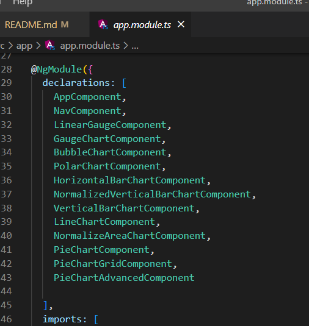
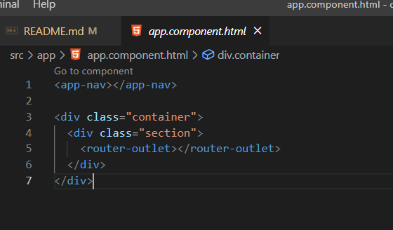
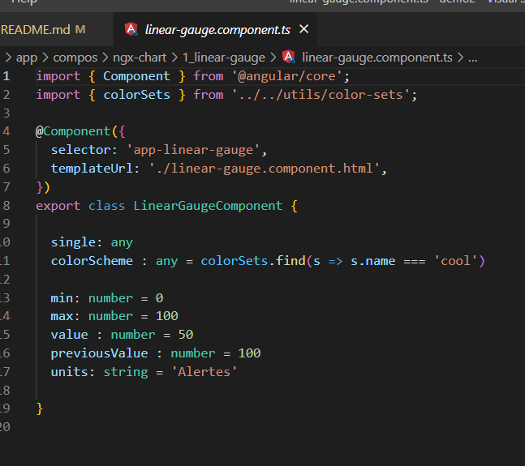
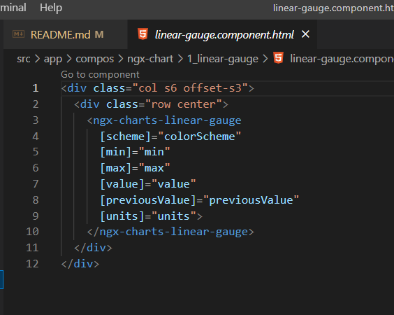
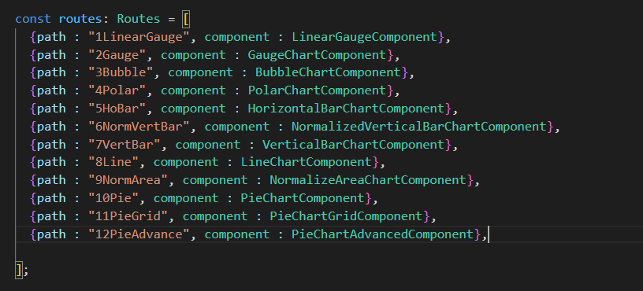
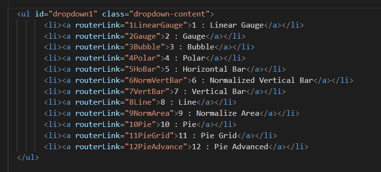

1. : Installer la version LTS de node JS
    - : vérifier dans une console que node et npm sont bien installé
        - : avec la commande `node -v` et `npm -v`

2. : Installer la dernière version d'angular sur votre machine en Global
    - : avec la commande `npm install -g @angular/cli`   (-g pour global à la machine et pas au projet !)
        - : Tester l'installation avec la commande `ng version`    (attention il vaux mieux relancer une console)

3. : Pour créer un projet, se mettre dans le répertoire souhaiter et lancer la commande
    - : `ng new nomPorjet --skip-tests`
    - : Il vous demande pour ajouter auto le router on dit "y"
    - : Et on choisi le style avec scss

4. : Pour la DataViz -> installer la librairie ngx-chart avec la commande `npm i @swimlane/ngx-charts --save`
    - : Vérifier également dans le fichier package.json en racine si @swimlane est bien cité
    - : Ajouter la ligne d'import dans le `app.module.ts` dans la partie `import : []` -> 
        - : NgxChartsModule avec l'import `import { NgxChartsModule } from "@swimlane/ngx-charts"`

5. : Couper VS Code, et relancer dans la raçine du projet !!! et bien vérifier dans le terminal que l'on soit dedans !
    - : lancé le projet avec la commande `ng serve --port 4200`
    - : Si vous obtenez une erreur comme quoi le systeme ne pas pas lancer de script bla bla bla, lancer la commande suivante
    - : `Set-ExecutionPolicy -Scope "CurrentUser" -ExecutionPolicy "Unrestricted"` (une fois faite, elle reste valable à vie)
    - : Si vous obtenez une erreur de types manquant  genre d3-scales et d3-selection lancez les deux commandes suivantes
    - : `npm i --save-dev @types/d3-selection`
    - : `npm i --save-dev @types/d3-scale`

6. : le app.compo.html contient le code de base prévu par angular, ne laisser que la ligne du router `<router-outlet>`
    - : Materialize : `https://materializecss.com/`
    - : ajouter au besoin une librairie css comme materialize -> ajouter les deux lignes suivante dans le index.html de la racine dans le `<head>`
    - : `<link rel="stylesheet" href="https://cdnjs.cloudflare.com/ajax/libs/materialize/1.0.0/css/materialize.min.css">`
    - : ``

        - : pour créer un compo, lancer la commande suivante dans un terminal dans la racine du projet: `ng g c folder/nomCompo`
        - : ne pas oublier une petite navbar, et votre routage ! 
        - : ajouter par exemple dans le app.routing.module.ts dans le tableau des routes -> `{ path : "url", component : nomCompo }`
        - : n'oubliez pas que les liens de navigation ne sont pas des `<a href="url">` mais bien `<a routerLink="path">`

7. pour la publication sur github, ajouter votre projet sur github proprement
 - : ajouter la package suivant `ng add angular-cli-ghpages`
 - : lancer ensuite la commande suivante `ng deploy --base-href=/<<nameRepositoryGithub>>/`
    - : si une erreur rouge apparait c'est surement la configuration de git qui ne permet pas les long fichier
        - : rendez vous dans `C:\Program Files\Git\etc` ouvrez en admin le fichier gitconfig et ajouter dans la partie `core` cette ligne : `longpaths = true` 
 - : tout devrait fonctionner sur la page `https://<< userNameGitHub >>.github.io/<< repositoryName >>`
 - : exemple d'url du repository de votre app faite avec moi : `https://evengyl.github.io/BXL_formation_dataviz_demo_graph_data`

## exemple de code du module pour les déclarations:

## exemple de code structure de base du compo racine:

## exemple de code compo avec variable pour graphique:

## exemple de code graphique de gauge:

## exemple de code router général:

## exemple de code Sur le router link de navigation:

# Exos récap

1. Créer une nouvelle installation angular node npm
    -   Lancer un nouveau projet propre (on enlève les choses inutiles)

2. Créer un app SPA (single page app) comportant une page d'acceuil simple mais clair sur un rapport de datas (présentation)
3. n'oubliez pas le compo de nav bar
4. préparer une simple page de contact avec un micro formulaire html ! pas d'angular ici, voir materialize
5. préparer une page de rapport à mettre dans la navigation : 
    - cette page devra comprendre 5 graphiques ngx différents mettant en scène différentes propositions de datas sur base du thème choisi. (voir les possibilités de mockaroo)
    - attention de bien respecter les formats des datas ! 
    - attention également que si vous avez différents graphiques vous aurez également les même variables plusieurs fois dans votre .ts
    - on pallie à ceci avec des nom différent par exemple : color devient monGraph1Color monGraph2Color
    - utilisez `https://www.mockaroo.com/` pour générer des datas.
    - n'oubliez pas de soigner le style, comme si vous deviez présenter à une entreprise, la révolution 2023
    - : La liste des couleur des graphiques se trouve dans cette demo dans le fichier `app.components.html`